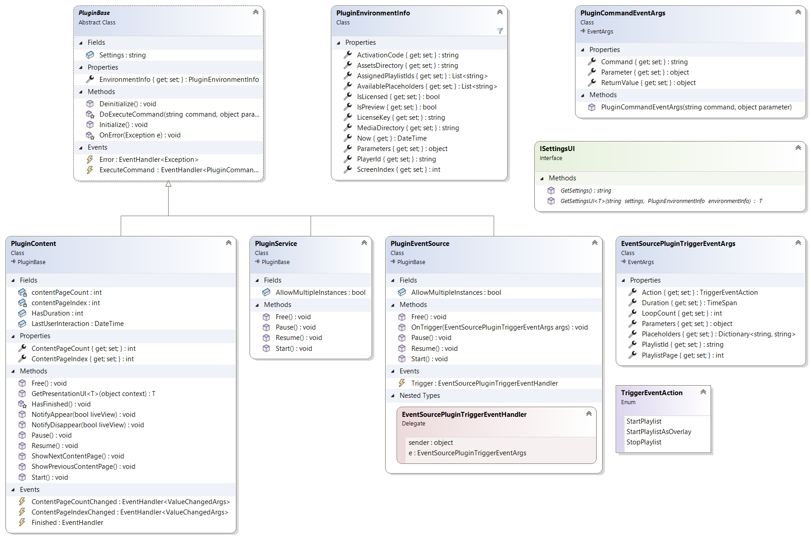
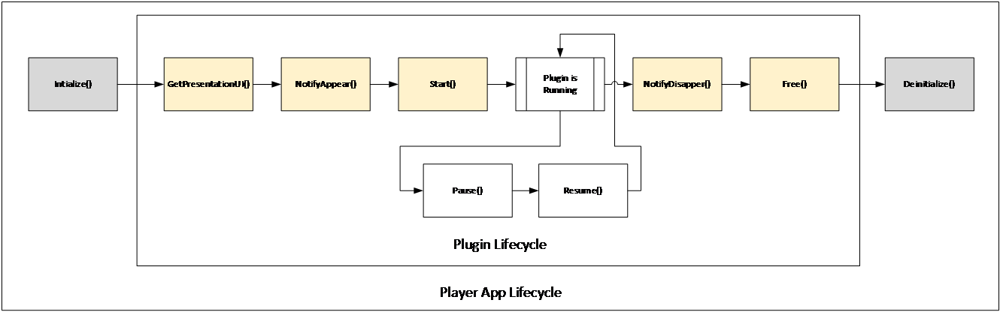
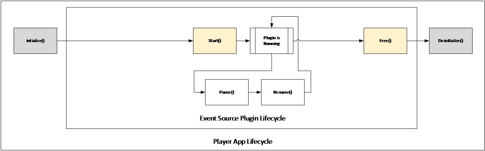
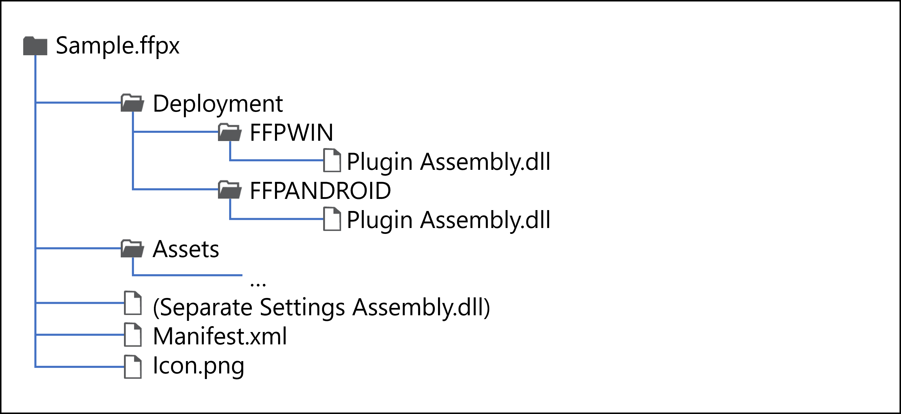
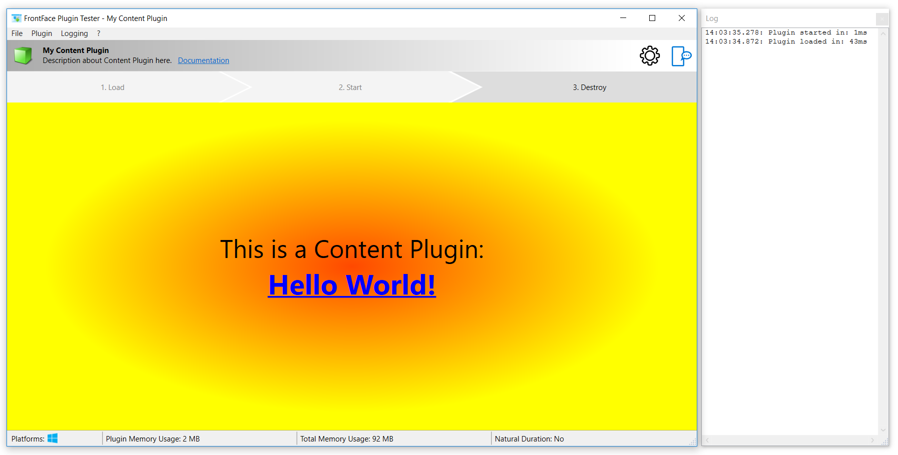
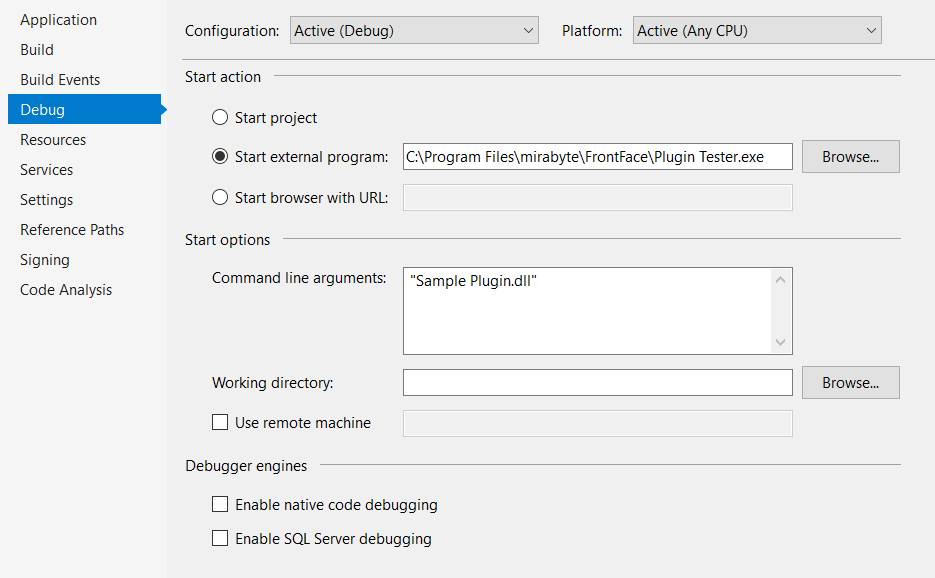

# FrontFace Plugin SDK - Documentation

**Version 4.7.6** (Rel. 23-07-2024)

The *FrontFace Plugin SDK* allows you to extend the [FrontFace digital signage & kiosk software](https://www.mirabyte.com/en/frontface/) with custom functionality. The SDK (Software Development Kit) is based on the *Microsoft .NET 4.8 Framework* and *Windows Presentation Foundation (WPF)*. For developing your own plugins, you also need *Microsoft Visual Studio 2022* (both, the regular versions as well as the free [Community Editions](https://visualstudio.microsoft.com/en-US/vs/community/) are supported!). Plugins can be either written in C# (recommended) or in any other .NET language like e.g., VB.NET.

> **Important:** To be able to develop a plugin for FrontFace you need to have basic programming skills and should be familiar with technologies like C#, Microsoft .NET Framework, WPF (Windows Presentation Foundation) and XAML!

**Table of Contents:**


1. [Overview & Plugin Types](#1-overview--plugin-types)
2. [Plugin Architecture](#2-plugin-architecture)
3. [Implementing a Content Plugin](#3-implementing-a-content-plugin)
4. [Implementing an Event Source Plugin](#4-implementing-an-event-source-plugin)
5. [Implementing a Service Plugin](#5-implementing-a-service-plugin)
6. [PluginEnvironmentInfo Class](#6-pluginenvironmentinfo-class)
7. [File Structure and Deployment](#7-file-structure-and-deployment)
8. [Sample Projects and Plugin Tester Application](#8-sample-projects-and-plugin-tester-application)
9. [Debugging Plugins using Microsoft Visual Studio](#9-debugging-plugins-using-microsoft-visual-studio)
10. [Logging](#10-logging)
11. [Thread Safety and Multiple Instances](#11-thread-safety-and-multiple-instances)
12. [32/64 Bit Platform Architecture](#12-3264-bit-platform-architecture)
13. [Technical Support and Help](#13-technical-support-and-help)

## 1.	Overview & Plugin Types
There are three different types of plugins that are supported by FrontFace: 

***Content Plugins***, which are visually shown as media objects on the screen in a playlist or a touch menu (like e.g., the “Schedule” plugin that displays a calendar on the screen).  
***Event Source Plugins***, which can trigger the start/stop of a specific playlist based on an event (like the “Screensaver” event source plugin which starts a given playlist if there is no interaction by the user for a given period of time).  
***Service Plugins***, which run in the FrontFace Player App to perform tasks in the background.

The required classes and data structures that are needed to implement a custom plugin are exposed by the DLL file ``FrontFace.Plugin.dll``:



## 2. Plugin Architecture
Basically, a plugin is a .NET dynamic link library (DLL) file which contains a class that is either derived from the class ``FrontFace.Plugin.PluginContent``, ``FrontFace.Plugin.PluginEventSource`` or ``FrontFace.Plugin.PluginService``.

``FrontFace.Plugin.PluginBase`` in the abstract base class that contains all the methods and properties that both plugin types have in common. The class name of the custom plugin and the filename of the DLL you create is up to you.

To create a custom plugin, create a new Visual Studio project using the project template “WPF User Control Library (.NET Framework)”. Next, add a reference to the ``FrontFace.Plugin.dll`` assembly which is in the installation folder of FrontFace (“C:\Program Files\mirabyte\FrontFace\”).

Then, add a new class to the project which derives from either ``FrontFace.Plugin.PluginContent``, ``FrontFace.Plugin.PluginEventSource``, or ``FrontFace.Plugin.PluginService``, depending on which type of plugin you want to create.

The plugin class itself must implement several methods and properties which are described in the following sections in detail.

> **Important:** You should not execute any code in the constructor of the plugin class since the constructor is called in various situations, e.g., when the plugin is loaded, executed or even if only the settings dialog is shown in the FrontFace Assistant.

A content plugin always has the method ``GetPresentationUI(object context)<T>`` which needs to return a WPF user control that contains whatever the plugin is supposed to show on the screen (e.g., a dashboard, multimedia content, etc.). An event source plugin does not have a graphical user interface (GUI) since its purpose is to trigger the start or stop of playlists based on events. Therefore, it must raise ``Trigger`` events.

Both plugin types are required to have a settings GUI that is presented to the user in the FrontFace Assistant when adding or modifying an instance of the plugin in a playlist or touch menu. To add the settings GUI, simply create another WPF user control and a class in your project which implements the ``ISettingsUI`` interface. If you set the ``Background`` property of the user control to ``null``, the FrontFace Assistant will automatically set the Foreground property to ``WhiteSmoke``. The ``ISettingsUI`` class passes the current, persisted settings from the settings parameter (a string) of the ``GetSettingsUI(string settings, PluginEnvironmentInfo: environmentInfo)<T>`` method that is called by the FrontFace Assistant to request an instance of the settings GUI, to the user control. The string ``GetSettings()`` method must be implemented in order to return the settings from the user control as string back to the FrontFace Assistant. So, the actual settings must be serialized as string.

The way how the settings are serialized to/from that string is fully up to you. Using XML has proved to be a good choice. You can use the ``Serialize<T>()`` and ``Deserialize<T>()`` extension methods of the static ``FrontFace.Plugin.Serialization`` class for this purpose. Please see the included sample plugins for details on how to use these methods.

It is also possible to implement the settings GUI in an entirely separate DLL file. This is useful if other platforms than the Windows platform shall be supported by the plugin.

The ``PluginEnvironmentInfo`` class contains various information about the system on which the plugin is running and is passed both, to the actual plugin instance, and the settings GUI instance (see [section 5](#5-implementing-a-service-plugin) of this manual).

## 3. Implementing a Content Plugin

A **Content Plugin** is a plugin that shows something visually on the screen. Such a plugin can also allow interaction with the user (this however requires a touch screen or any other interface device on the player!).

When implementing a **Content Plugin**, you just implement a normal WPF user control. The ``ContentPlugin`` class then needs to implement some properties and methods that are used by the FrontFace Player App to run the plugin. These methods are being called in the order as shown below by the player app:



The methods have the following semantics:

* ``GetPresentationUI<T>(object context)``  
This method returns an instance of your user control which represents the UI of the plugin. In case of animations or other functions, these should not be started at this point. The context parameter is only used internally and can be ignored. Make sure that your user control looks good at any size since it will be shown within a layout container on screen. So, the actual size of the viewport is unknown until the plugin is started.

* ``NotifyAppear(bool liveView)``  
Before the plugin UI is shown on the screen, this method is called. Here you can start animations or prepare your control for being shown on the screen. If the ``liveView`` parameter is ``False``, you should perform this code later on in the ``Start()`` method because the user has configured the system in a way that during transition effects, the user interface should not be animated.

* ``Start()``  
This method is called when the plugin is fully visible on the screen and any transition effect has ended. Here you can start the operations of your plugin.

* ``Pause()``  
If the playlist is paused for whatever reason, this method is called. Your plugin should stop what it is currently doing but it should not yet dispose itself.

* ``Resume()``  
When a paused playlist is continued, this method is called. You can now resume the actions you have stopped when ``Pause()`` method was called.

* ``NotifyDisappear(bool liveView)``  
This method is called when the plugin is about to be removed from the screen. The ``liveView`` parameter is ``True`` if the plugin should continue to animate during the transition effect. If the value is ``False``, you should stop any visual animation on the screen by now.

* ``ShowNextContentPage()``
This method is called when the player asks the plugin to show the next page in a sequence of pages (pageable content). The method is not called if ``ContentPageIndex`` >= ``ContentPageCount``. If the content does not show any pageable content, this method can be ignored.

* ``ShowPreviousContentPage()``
This method is called when the player asks the plugin to show the previous page in a sequence of pages (pageable content). The method is not called if ``ContentPageIndex`` <= ``ContentPageCount``. If the content does not show any pageable content, this method can be ignored.

* ``Free()``  
This is the last method that is called when the plugin has disappeared from the screen and is not needed any more. You should now finally stop any actions, timers or animations and dispose anything that needs to be disposed. After that, the plugin instance is gone and will be ultimately removed by the .NET garbage collector.

To tell the player app if the plugin has a natural duration (e.g., like a video), you have to make sure that the plugin returns either ``0`` if it has no duration (like e.g., a picture) or ``1`` if it does have a duration (e.g., like a video) as value of the ``HasDuration`` property. If the plugin does have a natural duration, please make sure that you fire the ``Finished`` event by calling the ``HasFinished()`` method in order to tell the hosting FrontFace player app that the plugin has now ended.

If the plugin displays pageable content (content that consists of mulitple screen pages, e.g. a multi-page document), you need to set the ``ContentPageCount`` and ``ContentPageIndex`` properties to tell the hosting FrontFace player app the total number of available pages and the index of the currently displayed page. The intial values of both properties is ``1`` (= non-pageable content). The ``ContentPageIndex`` of the first page is ``1``; the ``ContentPageIndex`` of the last page equals ``ContentPageCount``. Both, the total number of pages and the current page index can be updated at any time during the lifecycle of the plugin (e.g. if ``ShowNextContentPage()`` or ``ShowPreviousContentPage()`` is called or if the number of pages should change). Updates of the these properties are propagated automatically to the hosting FrontFace player app.

If your plugin interacts with the user, please set the LastUserInteraction property to the current date/time (``DateTime.Now``) of the system clock whenever there was an interaction with the user.

## 4. Implementing an Event Source Plugin

An **Event Source Plugin** has no visual that appears on the screen. It runs in the background (like a “service”) and triggers the start/stop of playlists based on events. A plugin can generate the events by itself, or it can listen to some other external event source (e.g., a calendar where appointments that become due represent events, a backend system with business rules or a sensor that reacts on something).

The class that implements the **Event Source Plugin** is derived from the ``PluginEventSource`` class. There is a set of methods which need to be implemented. These methods are called by the FrontFace Player App when the plugin is loaded. When the plugin is running, it can fire ``Trigger`` events that pass the ``EventSourceTriggerEventArgs`` data structure to the FrontFace Player App for further processing.

These methods are being called in the order as shown below by the player app:



The methods have the following semantics:

* ``Start()``  
This method is called when the plugin is started. If your plugin implements some kind of polling mechanism, you should start your timer here.

* ``Pause()``  
If the player does not want to receive any events for a period of time, this method is called to signal the plugin that it should stop generating events. In a polling scenario you can pause your timer.

* ``Resume()``  
Once the player again wants to receive events by the plugin, this method is called. In a polling scenario you can resume your timer again.

* ``Free()``  
When the plugin is supposed to be stopped, the free method is called. You must stop all running timers and processes at this point and should make sure that the .NET garbage collector can remove the entire plugin instance at any point from now.  

  If your plugin shall raise an event, call the ``OnTrigger()`` method to raise a ``Trigger`` event. The ``EventSourceTriggerEventArgs`` structure tells the player what to do:

  * ``Action``  
Tells the player app what to do. In most cases ``StartPlaylist`` will be the typical value to select in order to start the playlist that is associated with this event source in the FrontFace Assistant.

  * ``Duration``    
The period of time for which the playlist that is triggered by the event should run. If you set a value lower than 5 seconds (which is the minimum duration), the playlist will be shown forever or for the given number of loops (see ``LoopCount``).

  * ``LoopCount``  
Instead of providing a duration (see ``Duration``) you can also set the number of loops for which the playlist should be shown. E.g., if you set a value of ``0`` the playlist will be shown only once, for a value if ``0`` it will be shown twice, etc. - A value of ``-1`` indicates that the playlist will run forever (or as long as defined in the ``Duration`` field).

  * ``Parameters``  
This field is reserved for future use.

  * ``Placeholders``  
In this dictionary you can set the values of the placeholders you want to fill. A list of available placeholders in the current context can be retrieved from the ``AvailablePlaceholders`` list in the ``PluginEnvironmentInfo`` structure.

  * ``PlaylistId``  
The ID of the playlist that is supposed to be started. If you leave this field empty, the default/first playlist that is associated with this event source in the FrontFace Assistant will be started. If more than one playlist is assigned to the event source (as stated in the ``AssignedPlaylistIds`` field of the ``PluginEnvironmentInfo`` structure), you can set the ID of the playlist you want to start.

  * ``PlaylistPage``  
The index of the page on which the playlist should start. If you set ``-1`` (default), the playlist will start from the beginning. The index of the first page is ``0``.

If your plugin does support multiple instances that run at the same time, make sure to set the ``AllowMultipleInstances`` property to return ``True``. However, you must make sure by yourself that your plugin works correctly if multiple instances get created within the same app domain. Please see [section 9](#9-debugging-plugins-using-microsoft-visual-studio) of this document for details!

## 5. Implementing a Service Plugin

A **Service Plugin** has no visual that appears on the screen. It runs in the background (like a “service”) and is started, when the FrontFace Player App starts. In the ``Start()`` method, the plugin can start a timer or any other mechanism that allows to perform the required background tasks.

The class that implements the **Service Plugin** is derived from the ``PluginService`` class. There is a set of methods which need to be implemented. These methods are called by the FrontFace Player App when the plugin is loaded (on startup).

These methods are being called in the order as shown below by the player app:


The methods have the following semantics:

* ``Start()``  
This method is called when the FrontFace Player App is started. You should start a timer here that periodically performs the desired background task.

* ``Pause()``  
This method is called to signal the plugin that it should pause its background task. In a polling scenario you can pause your timer.

* ``Resume()``  
Once the player again wants the plugin to continue doing its background task, this method is called. In a polling scenario you can resume your timer again.

* ``Free()``  
When the plugin is supposed to be stopped, the free method is called. You must stop all running timers and processes at this point and should make sure that the .NET garbage collector can remove the entire plugin instance at any point from now.

If your plugin does support multiple instances that run that the same time, make sure to set the ``AllowMultipleInstances`` property to return ``True``. However, you must make sure by yourself that your plugin works correctly if multiple instances get created within the same app domain. Please see [section 11](#11-thread-safety-and-multiple-instances) of this document for details!

## 6. PluginEnvironmentInfo Class

The ``PluginEnvironmentInfo`` class contains various information about the system on which the plugin is running and is passed both, to the actual plugin instance, and the settings GUI instance.

The following properties are available (read-only):

| <!-- -->    | <!-- -->    |
|-------------|-------------|
|__``ActivationCode``__| The activation code of the player (=hardware ID). |
|__``AssetsDirectory``__| Path to the assets directory of this plugin. |
|__``AssignedPlaylistIds``__| List of IDs of playlists which are assigned to this plugin. |
|__``AvailablePlaceholders``__| List of available placeholders. |
|__``IsLicensed``__| Information of the player is licensed or a demo installation. |
|__``IsPreview``__| Information of the player is running in preview mode. |
|__``LicenseKey``__| The license key of the player (if licensed). |
|__``MediaDirectory``__| The media directory of the current project (append “Static\” to the the static directory of the current project!). |
|__``Now``__| The current date/time (takes a simulated date/time in preview mode				into account which can be set in the FrontFace Assistant!) |
|__``Parameters``__| Currently not used. |
|__``PlayerId``__| The ID of the player on which the plugin is running. |
|__``ScreenIndex``__| The index of the screen on which the plugin is showing. |

## 7. File Structure and Deployment

The plugin itself is a DLL file but in order to install it into a FrontFace project using the FrontFace Assistant, it has to be packaged as FrontFace Plugin File (``*.ffapx`` file extension).


An ``*.ffapx`` file is just a ZIP file with a different file extension that has the following, internal directory structure:



The actual DLL file of the plugin is stored in in the folder ``\Deployment\FFPWIN\`` (for Windows) or ``\Deployment\FFPADNDROID\`` (for Android). If your plugin requires further dependencies (other DLLs), these should also be placed in that folder. In addition to that, the plugin package also contains a PNG file with the icon (a resolution of 256x256 pixels is recommended) and an XML file called ``Manifest.xml`` which contains meta information about the plugin:

```xml
<?xml version="1.0" encoding="utf-8" ?>
<AddOn xmlns:xsi=http://www.w3.org/2001/XMLSchema-instance  
       xmlns:xsd=http://www.w3.org/2001/XMLSchema 
       schemaVersion="2.1" xsi:type="ContentPlugin" fileName="UniqueName">
  <Products>
    <Product name="FFPWIN" minVersion="4.6.0" codeBase="AssemblyName.dll" />
    <Product name="FFPANDROID" minVersion="4.6.0" codeBase="AssemblyName.dll" />
  </Products>
  <SettingsUI codeBase="Deployment\FFPWIN\AssemblyName.dll" />
  <Version>1.0.0</Version>
  <AllowMultipleInstances>true</AllowMultipleInstances>
  <AllowMultipleInstancesPerScreen>true</AllowMultipleInstancesPerScreen>
  <PlaylistSelectionCardinality>Multi</PlaylistSelectionCardinality>
  <PlaylistSelectionFilter>OnlySequentialPlaylists</PlaylistSelectionFilter>
  <Info>
    <Name>My Event Source Plugin</Name>
    <About>About my Event Source Plugin.</About>
    <Name lang="de">Mein Ereignisquellen-Plugin</Name>
    <About lang="de">Über mein Ereignisquellen-Plugin.</About>
  </Info>  
  <Descriptions>
    <Description>Description about the Plugin here.</Description>
    <Description lang="de">Beschreibung zum Plugin hier</Description>
  </Descriptions>
  <Manuals>
    <Manual><![CDATA[HTML-formatted text goes here...]]></Manual>
    <Manual lang="de"><![CDATA[HTML-formatierter Text hier...]]></Manual>
  </Manuals>
</AddOn>
```
> **Notice:** The XML Schema (XSD) for the plugin manifest file also available as part of this SDK ([``Manifest.xsd``](../Manifest.xsd)). You can use the schema to validate your own, custom manifest file.

### Specification of Plugin Type

In the ``AddOn`` tag, the type (``xsi:type`` attribute) of the plugin (either **``ContentPlugin``**, **``EventSourcePlugin``** or **``ServicePlugin``**) is specified. In addition to that, the filename of the ``*.ffapx`` file without the file extension is specified (``filename`` attribute) need to be given. This name is used internally and should be unique!

The ``Version`` tag is used to determine the version of the plugin (Major.Minor.Build). 

The tag ``AllowMultipleInstances`` indicates if the plugin may be instanciated more than once at the same time at runtime. Specifically for **Event Source Plugins**, which are registered per screen, the optional tag ``AllowMultipleInstancesPerScreen`` is available which lets you limit the number of instances of the plugin per screen.

For event source plugins and service plugins, the optional tag ``PlaylistSelectionCardinality`` defines if the plugin should allow the selection of ``None``,``Single`` or ``Multi`` playlists and the tag ``PlaylistSelectionFilter`` defines, if these playlists can be of any type (``All``) or ``OnlySequentialPlaylists`` or ``OnlyTouchMenus``.

### Plugin DLLs & Supported Platforms

The actual DLL file of the plugin is defined in the ``codebase`` attribute of the ``Product`` tag within the ``Products`` tag (only the name of the DLL). If you also provide an Android version of your plugin, an additional ``Product`` tag with the name attribute ``FFPANDROID`` must be specified. Otherwise, only one ``Product`` tag with the name attribute ``FFPWIN`` is required.

The settings GUI is referenced by the ``codebase`` attribute of the ``SettingsUI`` tag. Please note, that here, the full, relative path must be specified. In case the plugin DLL and the settings GUI DLL are the same, you must specify the path as ``Deployment\FFPWIN\AssemblyFile.dll`` if ``AssemblyFile.dll`` is your plugin DLL. The settings DLL must always be a Windows DLL since the settings UI is only used by the FrontFace Assistant. This means that plugins that are developed for Android only, always need to have a separate Windows DLL for the settings dialog.

If your plugin only works with a specific version of FrontFace, you can also define a ``minVersion`` that refers to the installed product version of FrontFace. When running an older version of FrontFace, the FrontFace Assistant will not allow the user to install the plugin.

### 3rd Party DLLs and Dependencies

In case you use 3rd party libraries, you need to supply the required DLL files together with your plugin DLL. The files must be stored in the same folder (either ``FFPWIN`` or ``FFPANDROID``) as the plugin DLL file.

### Versioning

You may also specify a ``Version`` of your plugin (schema: ``Major.Minor.Build``). Older versions of a plugin cannot be installed over newer versions of the same plugin (the FrontFace Assistant will show a warning!)

### Multi-Instance-Support

If your plugin supports running multiple instances at the same time, the ``AllowMultipleInstances`` must be set to ``True`` and otherwise to ``False``.

### Naming and Localization

The name of the plugin that is displayed to the user is specified using the ``Name`` tag and the ``About`` tag in the ``Info`` tag. Since the name and the about text can be localized, you can add different texts for any language that you want to support. Just add the ``lang`` attribute to the ``name`` tag and set the ISO two-letter language code as value. The same also applies for the description text which is stored in the ``Description`` tag(s) within the ``Descriptions`` tag. 

### Documentation / Manual

If you want to provide a user manual, you can either enter HTML-formatted text to the ``Manual`` tag in the ``Manuals`` tag as CDATA or instead, reference to a PDF file that is located in the ``\Assets\`` folder of the plugin package (for more complex manuals!).

### Additional Files

The ``\Assets\`` folder may also be used to store any accompanying files (such as sample files) that the user might require when working with the plugin. These files can be accessed from within the plugin settings dialog in the FrontFace Assistant.

## 8. Sample Projects and Plugin Tester Application

The FrontFace Plugin SDK includes two sample plugins (a **Content Plugin** and an **Event Source Plugin**) for both Windows and Android that come with full C# source code (``Sample Content Plugin.sln`` and ``Sample Event Source Plugin.sln``) which show how a plugin can be implemented.

To build the sample projects you first need to update the reference to the ``FrontFace.Plugin.dll`` assembly. This file is located in the FrontFace installation folder (``C:\Program Files\mirabyte\FrontFace\``).

To test a plugin, you install the plugin in a FrontFace project using the FrontFace Assistant. However, the FrontFace Plugin SDK also includes an application called ``Plugin Tester.exe`` that helps you to test your plugins prior to trying them with FrontFace. When you start the Plugin Tester application, you can select the plugin DLL file (for testing while developing) or the final ``*.ffapx`` file from a file dialog. Alternatively, you can also specify the filename and path as command line argument for the plugin tester application (which allows an easy integration into Visual Studio or other IDEs, see [section 9](#9-debugging-plugins-using-microsoft-visual-studio) for details!).

By clicking on the lifecycle steps “Load”, “Start” and “Destroy”, you can simulate the lifecycle of the plugin in the FrontFace Player App.



The Plugin Tester application can be used to test both, the presentation UI of a Content Plugin, the trigger of an Event Source Plugin, a Service Plugin and the the settings GUI. Please note that the Plugin Tester cannot run Android plugins since it is a Windows application.

Because some plugins may have references to 3rd party DLLs that are present in the FrontFace application directory, the Plugin Tester application must be present in the same folder as the FrontFace Player App and FrontFace Assistant!

The Plugin Tester application can also display the output of any logging activity of the plugin and has a built-in memory leakage detection function. This can be used to measure quantitatively if the plugin has a memory leak that may cause problems when running in 24/7 mode.

## 9. Debugging Plugins using Microsoft Visual Studio

Since a FrontFace plugin is a DLL file (shared library) you cannot directly run it within Visual Studio. To conveniently run and debug your plugin, you can integrate the included Plugin Tester application in Visual Studio. Open the *“Properties”* page of your plugin project and switch to the *“Debug”* tab. Select *“Start external program”* and enter the path to the ``Plugin Tester.exe`` which is in the installation folder of FrontFace on your system. Then, enter the name of your plugin DLL in the *“Command line arguments”* text box. In case the DLL file name of your plugin contains any blanks, please put the filename in quotation marks.



When you now click on *“Run”* in Visual Studio, the Plugin Tester application is started and automatically loads your plugin. If you select the “Debug” configuration in Visual Studio, you can also use debugging features such as breakpoints. If you have implemented your settings GUI in a separate DLL file, you must pass the path to this DLL file as a second command line parameter here.

If you only want to debug the separate settings DLL without having a main plugin DLL at hand, simply supply “None” as first command line parameter to ``Plugin Tester.exe`` and the DLL name of the settings DLL as second parameter. In this case, all features of the Plugin Tester will be disabled except for those that allow to modify the plugin’s settings.

Possible command line syntax for the Plugin Tester application:

```
Plugin Tester.exe "Sample Plugin.dll"
Plugin Tester.exe "Sample Plugin.dll" "Sample Plugin Settings.dll" 
Plugin Tester.exe None "Sample Plugin Settings.dll" 
```

## 10. Logging

If you want to log into the FrontFace log file or the log window of the Plugin Tester application, please use ``Trace.WriteLine()`` (for debug output), ``Trace.TraceError()``, ``Trace.TraceWarning()`` and ``Trace.TraceInformation()`` methods to write into the log file. Whether the output is shown depends on the log level setting of FrontFace and/or the Plugin Tester application.

## 11. Thread Safety and Multiple Instances

It is possible that multiple instances of a plugin are active at the same time (e.g. on a FrontFace playlist with a layout that has multiple containers). But also, when a playlist transitions from one page to the next one, there is a short period of time where both playlist pages live in the player at the same time and if both pages contain the same plugin, there are two instances that are alive at the same time.
You should keep this in mind when designing your plugin: Make sure that you do not use the Singleton pattern since this causes problems in multi-thread applications. Also, you should not use the .NET settings system (C#: ``Properties.Settings`` / VB.NET: ``My.Settings``) since this can produce race conditions when multiple plugin instances access the same settings object.

However, it is possible to use static variables to communicate between multiple instances of the same plugin, but you should use this with care since also here, race conditions and update anomalies can occur. All plugin instances live in the same app domain and can therefore (potentially) communicate with each other.

The best approach is to design a plugin in a way where the instances are fully isolated from each other so that you only use instance members and no static members.

## 12. 32/64 Bit Platform Architecture

By default, FrontFace supports both 32- and 64-bit systems. The entire FrontFace system is built against the *“Any CPU”* platform and comes with both 32 and 64 versions of native DLLs. On a 64-bit Windows system FrontFace will always run as 64-bit process and on 32-bit Windows systems as 32-bit process.

Please consider that – for maximum compatibility – you should also compile your plugins against the *“Any CPU”* platform. If you use architecture-specific 3rd party dependencies, please make sure that you supply both 32- and 64-bit versions and ensure that you automatically load the correct version.

If for some reason it is not possible to create a platform-neutral version of your plugin, you must make sure that your PCs run the same architecture as you are addressing. Otherwise, the plugin will fail to load!

## 13. Technical Support and Help
In case you have any technical questions or need help, please contact <support@mirabyte.com>!